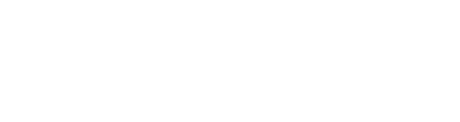

<!-- Improved compatibility of back to top link: See: https://github.com/othneildrew/Best-README-Template/pull/73 -->
<a name="readme-top"></a>
<!--
*** Thanks for checking out the Best-README-Template. If you have a suggestion
*** that would make this better, please fork the repo and create a pull request
*** or simply open an issue with the tag "enhancement".
*** Don't forget to give the project a star!
*** Thanks again! Now go create something AMAZING! :D
-->


<!-- PROJECT SHIELDS -->
<!--
*** I'm using markdown "reference style" links for readability.
*** Reference links are enclosed in brackets [ ] instead of parentheses ( ).
*** See the bottom of this document for the declaration of the reference variables
*** for contributors-url, forks-url, etc. This is an optional, concise syntax you may use.
*** https://www.markdownguide.org/basic-syntax/#reference-style-links
-->
[![Contributors][contributors-shield]][contributors-url]
[![Forks][forks-shield]][forks-url]
[![Stargazers][stars-shield]][stars-url]
[![Issues][issues-shield]][issues-url]
[![Cisco Sample Code License, Version 1.1][license-shield]][license-url]
[![LinkedIn][linkedin-shield]][linkedin-url]


<!-- PROJECT LOGO -->
<br />
<div align="center">
  <a href="https://github.com/jasoncdavis/CiscoLiveNOC2022LV">
    
  </a>

<h3 align="center">CiscoLive NOC Python Scripts</h3>

  <p align="center">
    Python scripts, MySQL DDL and other scripts and files used in the CiscoLive NOC
    <br />
    <a href="https://github.com/jasoncdavis/CiscoLiveNOC2022LV"><strong>Explore the docs »</strong></a>
    <br />
    <br />
    <a href="https://github.com/jasoncdavis/CiscoLiveNOC2022LV">View Demo (TBD)</a>
    ·
    <a href="https://github.com/jasoncdavis/CiscoLiveNOC2022LV/issues">Report Bug</a>
    ·
    <a href="https://github.com/jasoncdavis/CiscoLiveNOC2022LV/issues">Request Feature</a>
  </p>
</div>


<!-- TABLE OF CONTENTS -->
<details>
  <summary>Table of Contents</summary>
  <ol>
    <li>
      <a href="#about-the-project">About The Project</a>
      <ul>
        <li><a href="#built-with">Built With</a></li>
      </ul>
    </li>
    <li>
      <a href="#getting-started">Getting Started</a>
      <ul>
        <li><a href="#prerequisites">Prerequisites</a></li>
        <li><a href="#installation">Installation</a></li>
      </ul>
    </li>
    <li><a href="#usage">Usage</a></li>
    <li><a href="#roadmap">Roadmap</a></li>
    <li><a href="#contributing">Contributing</a></li>
    <li><a href="#license">License</a></li>
    <li><a href="#contact">Contact</a></li>
    <li><a href="#acknowledgments">Acknowledgments</a></li>
  </ol>
</details>


<!-- ABOUT THE PROJECT -->
## About The Project

[![Product Name Screen Shot][product-screenshot]](https://example.com)


<!-- GETTING STARTED -->
## Getting Started

You'll want to install Python 3.10 in a virtual environment and pip install the packages missing from your environment.  You'll also need to build a TIG stack - Telegraf, InfluxDB and Grafana.  There are PLENTY of internet resources available to help you.  Apache was installed for hosting the HTML files we generate in the custom dashboards not generated by Grafana.  Finally, we used MySQL database for some inventory and other state information storage.

### Prerequisites

This is an example of how to list things you need to use the software and how to install them.
* Python
  ```sh
  sudo apt install python
  ```

* Create virtual environment
  ```sh
  cd my_project_directory
  python3.10 -m venv .venv
  source .venv/bin/activate
  ```

### Installation

1. Clone the repo
   ```sh
   git clone https://github.com/jasoncdavis/CiscoLiveNOC2022LV.git
   ```
2. pip install packages
   ```sh
   pip install -r requirements.txt
   ```

<p align="right">(<a href="#readme-top">back to top</a>)</p>


<!-- USAGE EXAMPLES -->
## Usage

These scripts are not being shared specifically in an 'install and run' state, although they aren't far from it. I just need to spend more time on documentation to make it run-ready.  The scripts should, however, be good reference material for you in how to collect information useful in your environment.

_For more examples, please refer to the [Documentation](https://example.com)_

<p align="right">(<a href="#readme-top">back to top</a>)</p>


<!-- ROADMAP -->
## Roadmap

- [ ] Update Usage
- [ ] Add DD-CAM to this repo or reference other one

See the [open issues](https://github.com/jasoncdavis/CiscoLiveNOC2022LV/issues) for a full list of proposed features (and known issues).

<p align="right">(<a href="#readme-top">back to top</a>)</p>


<!-- CONTRIBUTING -->
## Contributing

Contributions are what make the open source community such an amazing place to learn, inspire, and create. Any contributions you make are **greatly appreciated**.

If you have a suggestion that would make this better, please fork the repo and create a pull request. You can also simply open an issue with the tag "enhancement".
Don't forget to give the project a star! Thanks again!

1. Fork the Project
2. Create your Feature Branch (`git checkout -b feature/AmazingFeature`)
3. Commit your Changes (`git commit -m 'Add some AmazingFeature'`)
4. Push to the Branch (`git push origin feature/AmazingFeature`)
5. Open a Pull Request

<p align="right">(<a href="#readme-top">back to top</a>)</p>


<!-- LICENSE -->
## License

Distributed under the Cisco Sample Code License, Version 1.1. See `LICENSE.txt` for more information.

<p align="right">(<a href="#readme-top">back to top</a>)</p>


<!-- CONTACT -->
## Contact

Jason Davis - [@SNMPguy](https://twitter.com/SNMPguy) - jadavis@cisco.com

Project Link: [https://github.com/jasoncdavis/CiscoLiveNOC2022LV](https://github.com/jasoncdavis/CiscoLiveNOC2022LV)

<p align="right">(<a href="#readme-top">back to top</a>)</p>


<!-- ACKNOWLEDGMENTS -->
## Acknowledgments

* JW McIntire
* Chris O'Donnell
* Jason Froehlich
* Kristopher Gabrielsen
* Richard Furr
* [MySQL](https://www.mysql.com/products/enterprise/database/)
* [InfluxDB](https://www.influxdata.com/products/influxdb-overview/)
* [Grafana](https://grafana.com/oss/grafana/)

<p align="right">(<a href="#readme-top">back to top</a>)</p>


<!-- MARKDOWN LINKS & IMAGES -->
<!-- https://www.markdownguide.org/basic-syntax/#reference-style-links -->
[contributors-shield]: https://img.shields.io/github/contributors/jasoncdavis/CiscoLiveNOC2022LV.svg?style=for-the-badge
[contributors-url]: https://github.com/jasoncdavis/CiscoLiveNOC2022LV/graphs/contributors
[forks-shield]: https://img.shields.io/github/forks/jasoncdavis/CiscoLiveNOC2022LV.svg?style=for-the-badge
[forks-url]: https://github.com/jasoncdavis/CiscoLiveNOC2022LV/network/members
[stars-shield]: https://img.shields.io/github/stars/jasoncdavis/CiscoLiveNOC2022LV.svg?style=for-the-badge
[stars-url]: https://github.com/jasoncdavis/CiscoLiveNOC2022LV/stargazers
[issues-shield]: https://img.shields.io/github/issues/jasoncdavis/CiscoLiveNOC2022LV.svg?style=for-the-badge
[issues-url]: https://github.com/jasoncdavis/CiscoLiveNOC2022LV/issues
[license-shield]: https://img.shields.io/github/license/jasoncdavis/CiscoLiveNOC2022LV.svg?style=for-the-badge
[license-url]: https://github.com/jasoncdavis/CiscoLiveNOC2022LV/blob/master/LICENSE.txt
[linkedin-shield]: https://img.shields.io/badge/-LinkedIn-black.svg?style=for-the-badge&logo=linkedin&colorB=555
[linkedin-url]: https://linkedin.com/in/jasoncdavis
[product-screenshot]: images/screenshot.png
[Next.js]: https://img.shields.io/badge/next.js-000000?style=for-the-badge&logo=nextdotjs&logoColor=white
[Next-url]: https://nextjs.org/
[React.js]: https://img.shields.io/badge/React-20232A?style=for-the-badge&logo=react&logoColor=61DAFB
[React-url]: https://reactjs.org/
[Vue.js]: https://img.shields.io/badge/Vue.js-35495E?style=for-the-badge&logo=vuedotjs&logoColor=4FC08D
[Vue-url]: https://vuejs.org/
[Angular.io]: https://img.shields.io/badge/Angular-DD0031?style=for-the-badge&logo=angular&logoColor=white
[Angular-url]: https://angular.io/
[Svelte.dev]: https://img.shields.io/badge/Svelte-4A4A55?style=for-the-badge&logo=svelte&logoColor=FF3E00
[Svelte-url]: https://svelte.dev/
[Laravel.com]: https://img.shields.io/badge/Laravel-FF2D20?style=for-the-badge&logo=laravel&logoColor=white
[Laravel-url]: https://laravel.com
[Bootstrap.com]: https://img.shields.io/badge/Bootstrap-563D7C?style=for-the-badge&logo=bootstrap&logoColor=white
[Bootstrap-url]: https://getbootstrap.com
[JQuery.com]: https://img.shields.io/badge/jQuery-0769AD?style=for-the-badge&logo=jquery&logoColor=white
[JQuery-url]: https://jquery.com 